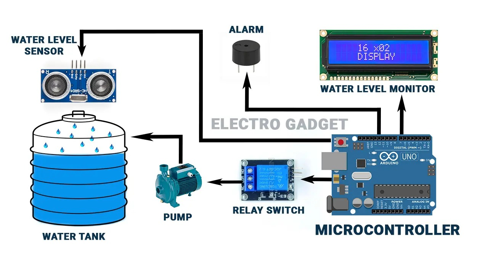
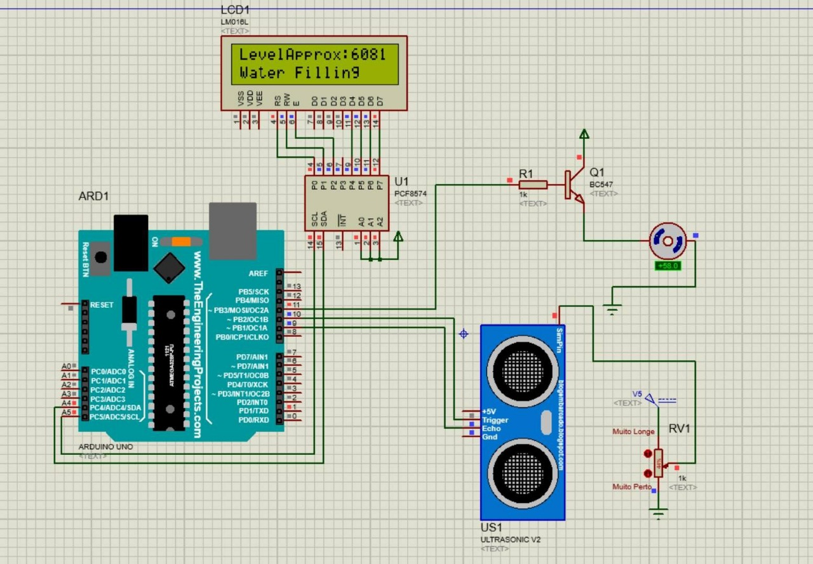

# Arduino Water Tank Monitoring System

## Overview
This project monitors water levels using Arduino and provides a real-time display.

## Block Diagram

## Schematic

## Hardware
 

## Usage
Follow the instructions in the hardware and schematic sections to get started!